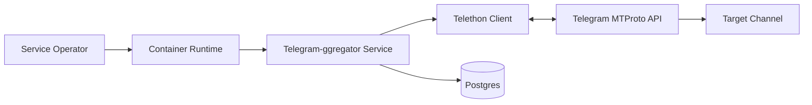
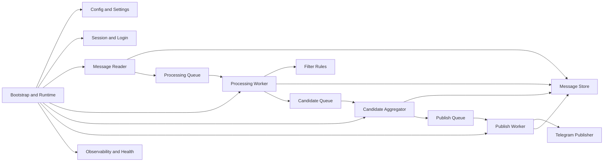
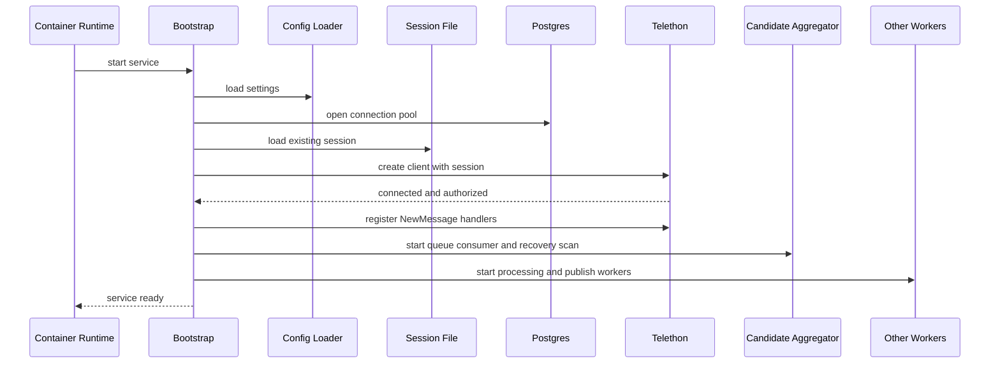
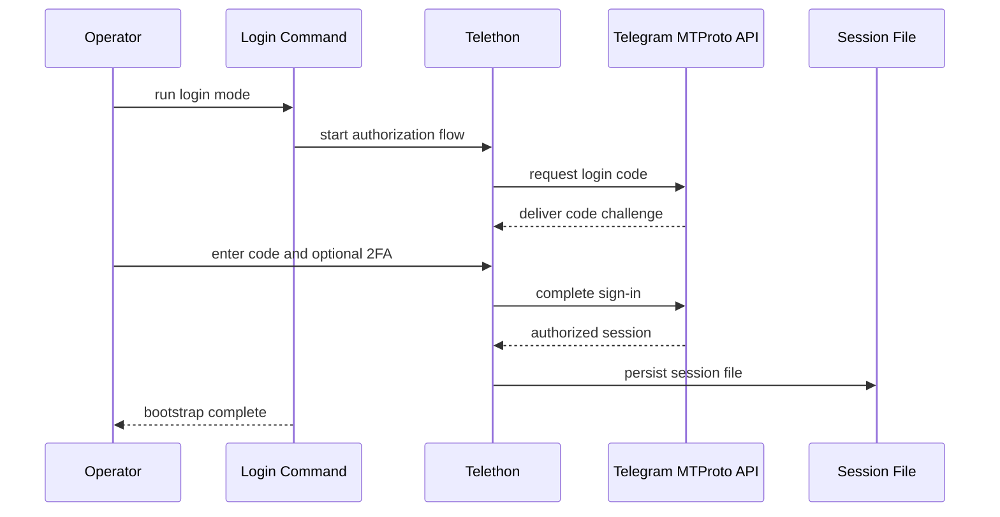
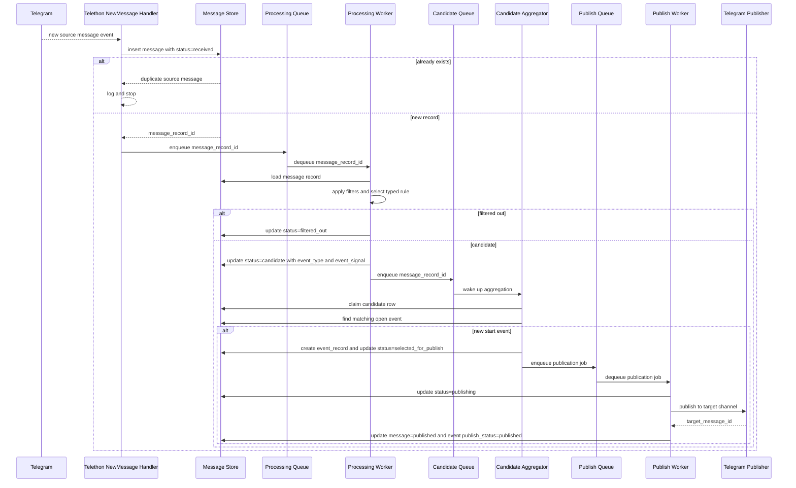
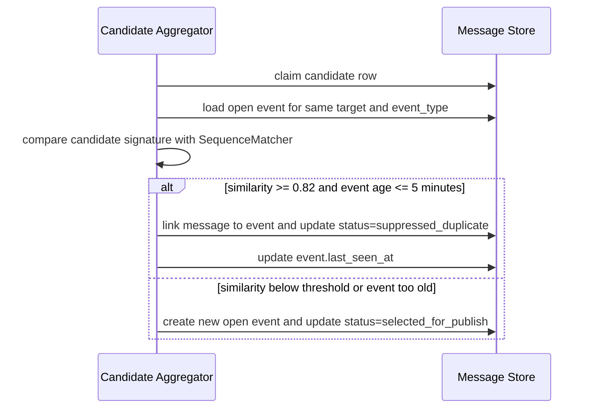
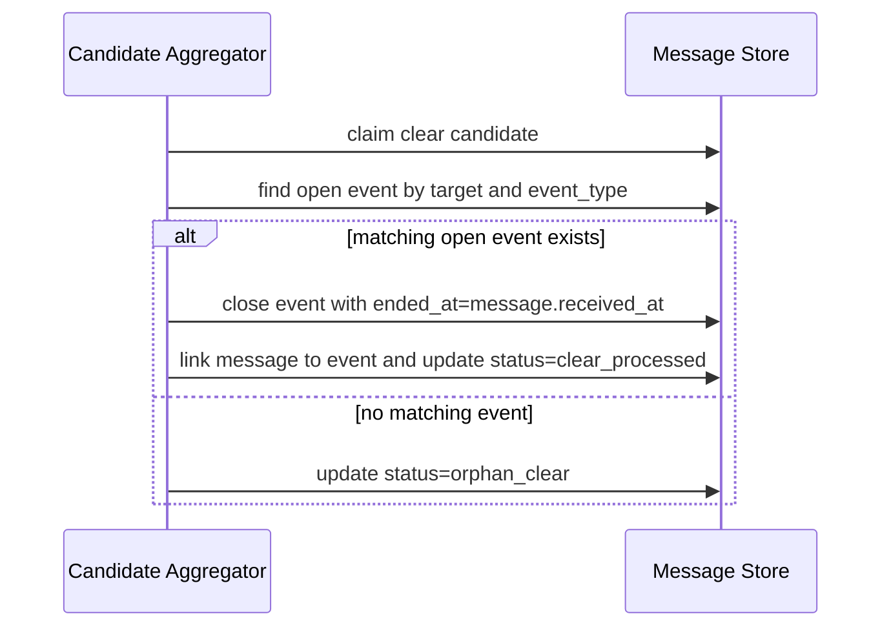
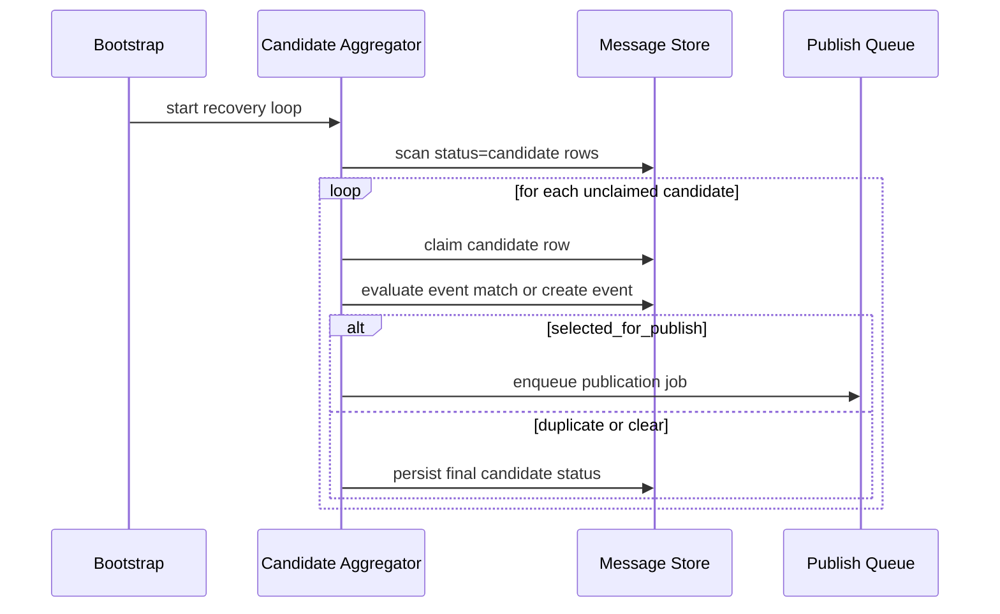
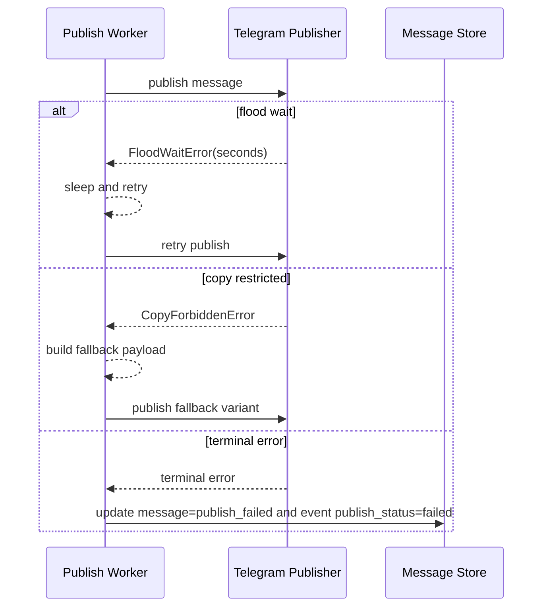

# Architecture Spec

## Purpose

This document is the implementation-oriented companion to [`architecture.md`](architecture.md).

The MVP architecture should stay simple:

- one deployable asynchronous Python service,
- component-oriented modular monolith,
- Telethon handles Telegram transport, reconnects, and event subscription,
- the application only registers new-message handlers and orchestrates processing,
- Postgres is the canonical persistence layer,
- processing, candidate aggregation, and publishing use in-process queues built on `asyncio.Queue`.

This specification intentionally does not introduce DDD layers, generic ports/adapters packages, or a separate domain model abstraction. The codebase should stay organized around concrete application components.

## Assumptions

- One deployable service for the MVP.
- One target Telegram channel for the MVP.
- No external broker for processing, candidate aggregation, or publishing.
- Telegram session state remains file-based and is mounted into the container runtime.
- Mermaid diagrams are the documentation format for component and sequence views.
- `src/Telegram-aggregator/` is a legacy scaffold. The canonical package root is `src/telegram_aggregator/`.
- `first arrival wins` is the canonical source-selection rule.
- The candidate aggregator does not hold back candidates to wait for better sources.
- A repeated `start` signal more than 5 minutes after the original event start opens a new event.
- A `clear` signal closes only an active event of the same `event_type` and is not published.

## System Context

The service runs as a long-lived containerized Python process. It connects to Telegram through Telethon, listens for new source messages, stores source message and event state in Postgres, and publishes selected threat signals to one target channel.



## Component View

The target runtime is organized around a small set of components with explicit responsibilities.



## Components And Responsibilities

### Bootstrap and Runtime

- Loads settings.
- Initializes Postgres connections.
- Creates in-process queues.
- Starts Telethon, workers, and health hooks.
- Starts the candidate-aggregator recovery loop alongside normal queue consumers.
- Owns graceful startup and shutdown.

### Config and Settings

- Loads environment variables and file-based configuration.
- Validates source list, typed include rules, exclude rules, target channel, queue sizes, and runtime toggles.
- Keeps secrets in environment variables, not in source-controlled config.

### Session and Login

- Uses Telethon session files for Telegram user authorization.
- Supports normal startup when a session already exists.
- Supports explicit login bootstrap flow when no session is available.
- Does not store 2FA passwords in plain text.

### Message Reader

- Registers Telethon `NewMessage` handlers for configured sources.
- Normalizes incoming Telethon events into an internal message record shape.
- Persists newly seen source messages with initial processing state.
- Pushes new record identifiers into the processing queue.

The reader is intentionally thin. It does not implement Telegram transport, websocket logic, or reconnect behavior itself. Those concerns stay inside Telethon.

### Message Store

- Uses Postgres as the source of truth for source messages, candidate state, and logical event state.
- Stores source identifiers, message identifiers, normalized content, typed rule match data, processing status, publish result, and error details.
- Preserves a durable relation between source messages and logical events.
- Exposes simple repository methods used by the reader, processing worker, candidate aggregator, and publish worker.

### Processing Queue

- In-memory `asyncio.Queue`.
- Decouples Telegram event intake from filter evaluation.
- Exists only at runtime. Durable state stays in Postgres, not in the queue.

### Processing Worker

- Pulls message record identifiers from the processing queue.
- Loads the persisted message record from Postgres.
- Applies include and exclude filters.
- Selects the matched typed include rule that classifies the message.
- Updates status for filtered-out messages.
- Marks matching messages as `candidate` and pushes their identifiers into the candidate queue.

The processing worker does not perform deduplication, event grouping, source arbitration, or publication decisions.

### Filter Rules

- Filter config is a list of filter groups evaluated in configuration order.
- Include rules are typed objects with `pattern`, `event_type`, and `event_signal`.
- `event_signal` supports `start` and `clear`.
- Exclude rules remain blocking regex patterns without lifecycle semantics.
- Matching inspects message text and media captions.
- Normalization runs before matching when enabled.
- In `any` mode, the first matched include rule within the matching filter group classifies the candidate.
- In `all` mode, all include rules inside one filter group must share the same `event_type` and `event_signal`, otherwise configuration validation fails.
- If multiple filter groups match, the first matching group in configuration order wins.

### Candidate Queue

- In-memory `asyncio.Queue`.
- Acts as a fast wake-up path from processing to candidate aggregation.
- Does not own durable work state and may drop signals during restart without data loss.

### Candidate Aggregator

- Consumes candidate identifiers from the candidate queue.
- Runs a periodic Postgres recovery scan for `candidate` rows that were not handled in memory.
- Atomically claims candidate rows before event-level deduplication and publication handoff.
- Builds a candidate signature from normalized text after stripping URLs, usernames, punctuation, and repeated whitespace.
- Uses event-level deduplication within the same `target_channel` and `event_type`.
- Matches candidate signatures against open events using Python `difflib.SequenceMatcher` ratio on the normalized signature text.
- Treats signatures with a similarity ratio of `0.82` or higher as the same event when the open event started no more than 5 minutes earlier.
- Applies `first arrival wins` for canonical source selection.
- Creates a new logical event and a publication job for the first `start` candidate of a new event.
- Marks later matching `start` candidates as `suppressed_duplicate` and updates event recency data.
- Processes `clear` signals by closing the matching active event without publication.
- Marks unmatched `clear` signals as `orphan_clear`.

### Publish Queue

- In-memory `asyncio.Queue`.
- Receives publication jobs only from the candidate aggregator.
- Uses serialized publication in the MVP to reduce rate-limit pressure.

### Publish Worker

- Pulls publication jobs from the publish queue.
- Builds the target Telegram payload, attribution footer, and fallback behavior.
- Publishes through Telethon.
- Persists publish status, target message identifier, retry counters, and last error.
- Updates both the selected message record and the owning logical event with publication outcomes.

### Telegram Publisher

- Encapsulates Telethon send, copy, and forward operations for the target channel.
- Handles copy restrictions and configured fallback behavior.
- Converts Telethon-specific exceptions into application-level retry decisions.

### Observability and Health

- Emits structured logs for intake, filtering, candidate creation, aggregation, duplicate suppression, event closing, queueing, publishing, and failures.
- Exposes a container health signal and may optionally expose a lightweight HTTP health endpoint.
- Reports queue depth, worker liveness, candidate recovery lag, and Telegram/Postgres readiness at a high level.

## Boundary Rules

- Telethon owns MTProto transport, reconnects, and Telegram event subscription mechanics.
- The application owns message normalization, filter evaluation, candidate classification, event lifecycle, retry policy, and publication decisions.
- Postgres is the canonical durable state for source messages and logical events.
- Processing, candidate, and publish queues are runtime coordination primitives, not durable infrastructure.
- The processing worker only decides whether a message becomes a candidate and which typed rule matched it.
- The candidate aggregator is the only component allowed to deduplicate candidates, select a canonical source, track event lifecycle, and create publication jobs.
- The publish worker is the only component allowed to publish to the target channel.
- Avoid a separate `domain/`, `ports/`, or generic `adapters/` package hierarchy until the codebase proves it needs one.

## Internal Types

Recommended internal types for the implementation:

- `CandidateMessage`: a `message_record` that matched one typed include rule and is awaiting aggregation.
- `EventSignal`: `start | clear`.
- `EventRecord`: the logical event tracked across one or more candidate messages.
- `PublicationJob`: the selected message and target metadata ready for the publish worker.

## Minimal Persistence Model

The MVP should keep persistence centered on source messages and logical events.

Recommended primary table: `message_records`

- `id`
- `source_chat_id`
- `source_message_id`
- `source_title`
- `source_link`
- `raw_text`
- `normalized_text`
- `has_media`
- `event_type`
- `event_signal`
- `candidate_signature`
- `event_record_id`
- `status`
- `filter_reason`
- `target_message_id`
- `publish_attempts`
- `last_error`
- `received_at`
- `updated_at`

Recommended message status set:

- `received`
- `filtered_out`
- `candidate`
- `suppressed_duplicate`
- `selected_for_publish`
- `publishing`
- `published`
- `publish_failed`
- `clear_processed`
- `orphan_clear`

Recommended constraints and indexes:

- unique index on `(source_chat_id, source_message_id)`
- index on `status`
- index on `(event_type, status, received_at)`

Recommended secondary table: `event_records`

- `id`
- `target_channel`
- `event_type`
- `state`
- `started_at`
- `last_seen_at`
- `ended_at`
- `canonical_message_record_id`
- `published_target_message_id`
- `publish_status`
- `created_at`
- `updated_at`

Recommended event state set:

- `open`
- `closed`

Recommended publish status set:

- `pending`
- `published`
- `failed`

No separate join table is required for the MVP. The durable relation between source messages and logical events is `message_records.event_record_id`.

## Runtime Flows

### Startup With Existing Session



### First-Time Login / Session Bootstrap



### Candidate Flow With Publication



### Duplicate Suppression



### Clear Signal Flow



### Recovery After Restart



### Publish Resilience



## Target Code Structure

The target package structure should mirror runtime components instead of abstract architecture layers.

```text
src/telegram_aggregator/
  __init__.py
  __main__.py
  bootstrap/
  config/
  reading/
  storage/
  processing/
  candidate_aggregation/
  publishing/
  observability/
```

Recommended responsibilities by package:

- `bootstrap/`: startup, shutdown, runtime wiring, queue creation, login entrypoints.
- `config/`: settings, file parsing, rule validation.
- `reading/`: Telethon event handlers, source-message normalization, source subscription setup.
- `storage/`: Postgres connection management, schema, repositories for message and event state.
- `processing/`: filter compilation, queue consumer, candidate classification.
- `candidate_aggregation/`: candidate claim loop, fuzzy matching, event lifecycle, publication-job creation, restart recovery.
- `publishing/`: publish queue consumer, payload formatting, Telethon target publish operations, retries.
- `observability/`: structured logging, health checks, metrics hooks.

Avoid these for the MVP:

- separate `domain/` package,
- separate `ports/` package,
- generic `adapters/telegram/` and `adapters/postgres/` trees,
- external broker integration.

## Legacy Scaffold Note

The repository currently contains `src/Telegram-aggregator/`, which is a placeholder scaffold and not a valid long-term package layout. New implementation work should target `src/telegram_aggregator/`.

## Requirement Coverage Checklist

Each MVP requirement should map to one primary component:

- source subscription and incoming message handling: `reading/`
- login without a session file: `bootstrap/` and `reading/`
- typed include and exclude filtering: `processing/`
- candidate creation and status marking: `processing/`
- event-level deduplication across sources: `candidate_aggregation/`
- event lifecycle and clear handling: `candidate_aggregation/`
- persistent deduplication across restarts: `storage/` and `candidate_aggregation/`
- in-process flow control and throttling: `processing/`, `candidate_aggregation/`, and `publishing/`
- target channel posting and fallback behavior: `publishing/`
- health and structured logs: `observability/`

Key scenarios covered by this spec:

- startup with an existing session,
- first-time login without a session file,
- first candidate opening a new event,
- duplicate suppression for the same event across sources,
- `clear` closing a typed event without publication,
- duplicate prevention and recovery after restart.
