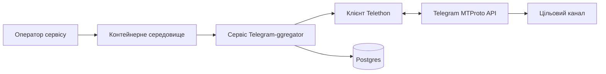
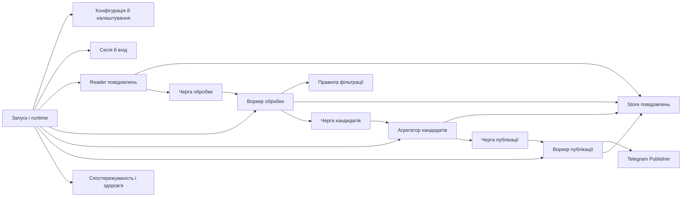
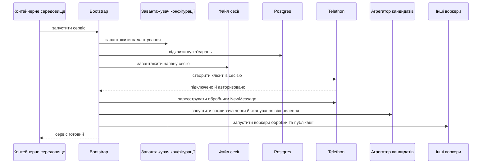
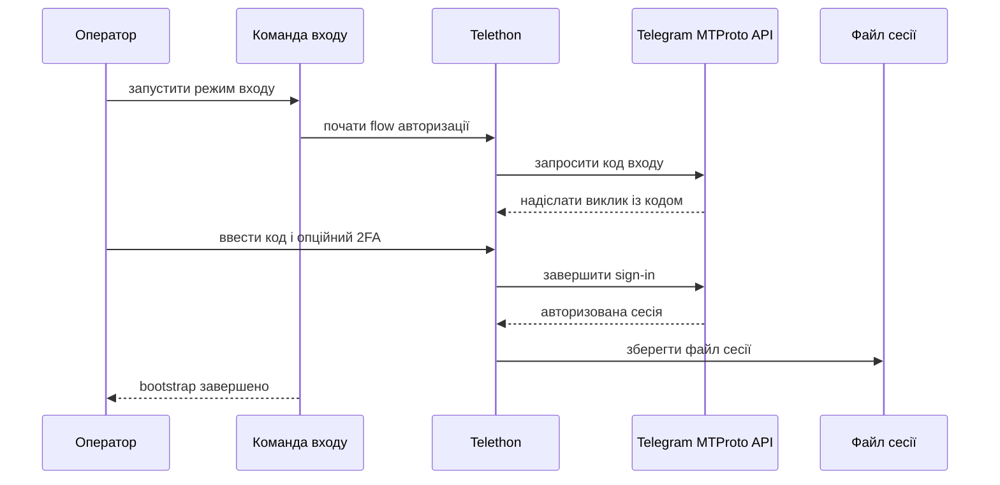
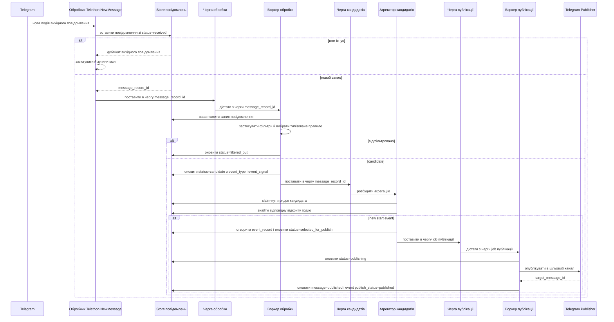
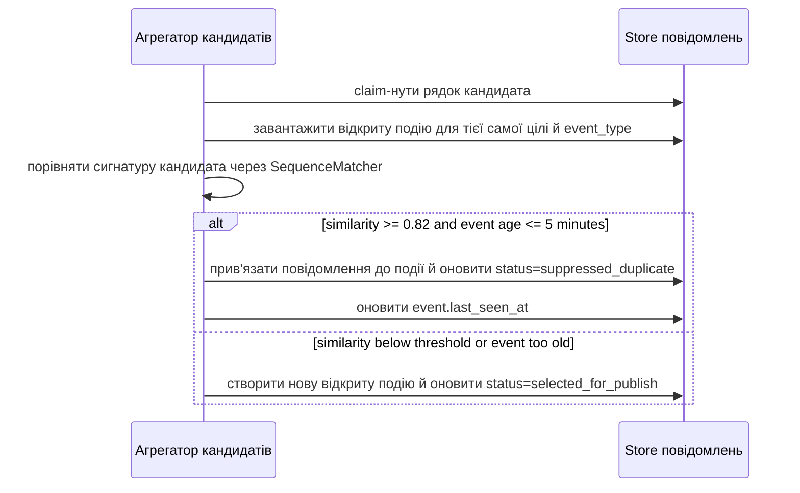
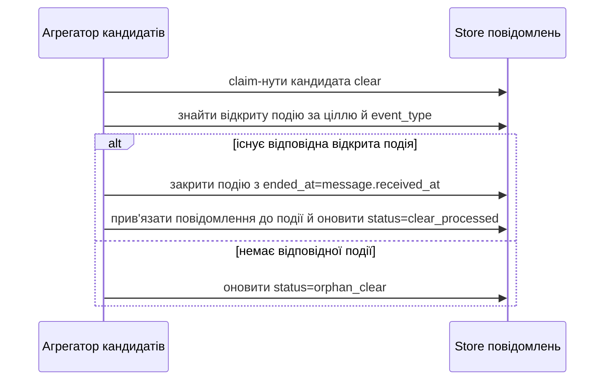
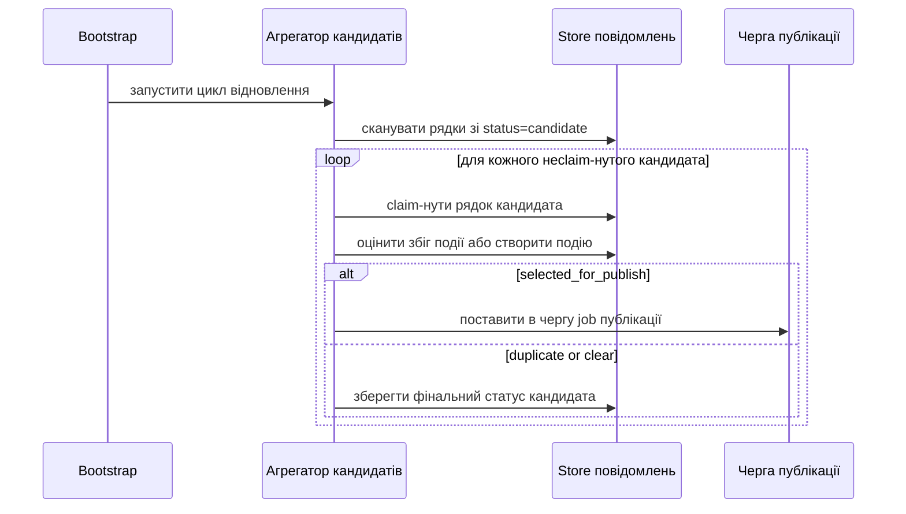
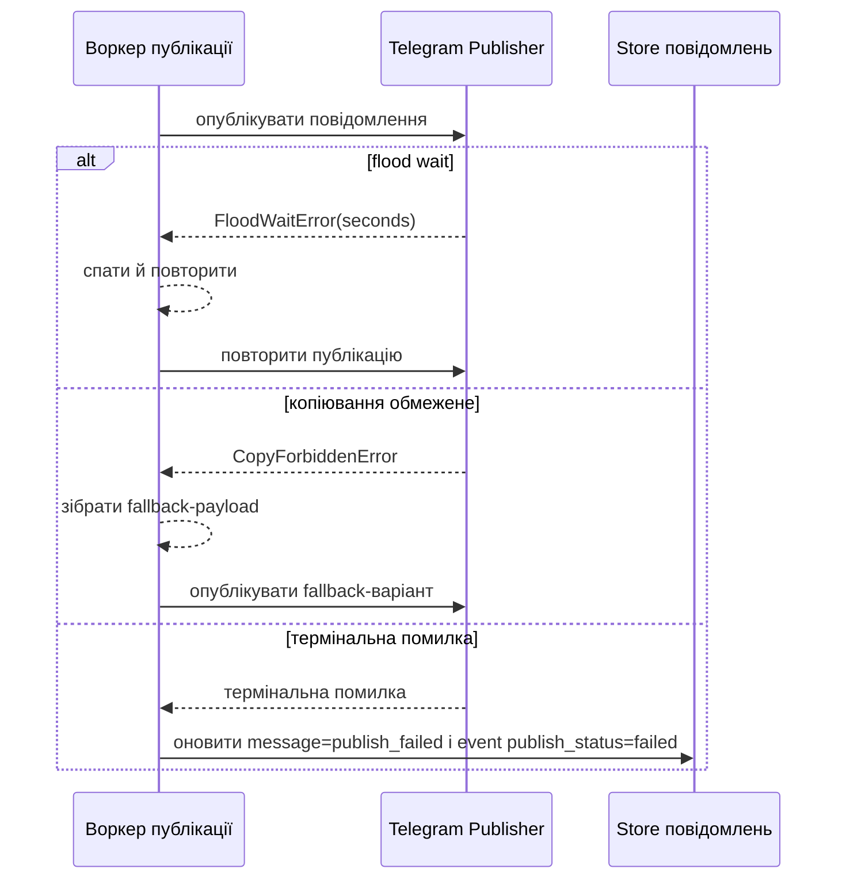

# Специфікація архітектури

## Призначення

Цей документ є доповненням до [`architecture.md`](architecture.md), орієнтованим на реалізацію.

Архітектура MVP має залишатися простою:

- один розгортний асинхронний Python-сервіс,
- компонентно-орієнтований модульний моноліт,
- Telethon обробляє транспорт Telegram, перепідключення й підписку на події,
- застосунок лише реєструє обробники нових повідомлень і оркеструє обробку,
- Postgres є канонічним шаром зберігання,
- обробка, агрегація кандидатів і публікація використовують черги в межах процесу на базі `asyncio.Queue`.

Ця специфікація навмисно не вводить шари DDD, узагальнені пакети ports/adapters або окрему абстракцію доменної моделі. Кодова база має лишатися організованою навколо конкретних компонентів застосунку.

## Припущення

- Для MVP є один розгортний сервіс.
- Для MVP є один цільовий Telegram-канал.
- Немає зовнішнього брокера для обробки, агрегації кандидатів або публікації.
- Стан Telegram-сесії лишається файловим і монтується в контейнерне середовище виконання.
- Mermaid-діаграми є форматом документації для компонентних і послідовнісних подань.
- `src/Telegram-aggregator/` є застарілим каркасом. Канонічний корінь пакета — `src/telegram_aggregator/`.
- `first arrival wins` є канонічним правилом вибору джерела.
- Агрегатор кандидатів не затримує кандидатів в очікуванні кращих джерел.
- Повторний сигнал `start` більш ніж через 5 хвилин після початкового старту події відкриває нову подію.
- Сигнал `clear` закриває лише активну подію того самого `event_type` і не публікується.

## Контекст системи

Сервіс працює як довгоживучий контейнеризований Python-процес. Він підключається до Telegram через Telethon, слухає нові вихідні повідомлення, зберігає стан вихідних повідомлень і подій у Postgres та публікує вибрані сигнали загроз в один цільовий канал.



## Представлення компонентів

Цільове середовище виконання організоване навколо невеликого набору компонентів із чіткими відповідальностями.



## Компоненти та відповідальності

### Запуск і runtime

- Завантажує налаштування.
- Ініціалізує з'єднання з Postgres.
- Створює черги в межах процесу.
- Запускає Telethon, воркери та хуки перевірки здоров'я.
- Запускає цикл відновлення агрегатора кандидатів паралельно зі звичайними споживачами черги.
- Володіє коректним стартом і завершенням.

### Конфігурація й налаштування

- Завантажує змінні середовища й файлову конфігурацію.
- Валідовує список джерел, типізовані правила include, правила exclude, цільовий канал, розміри черг і runtime-перемикачі.
- Тримає секрети у змінних середовища, а не в конфігурації під контролем версій.

### Сесія й вхід

- Використовує файли сесії Telethon для авторизації Telegram-користувача.
- Підтримує звичайний старт, коли сесія вже існує.
- Підтримує явний bootstrap-flow входу, коли сесії немає.
- Не зберігає паролі 2FA у відкритому вигляді.

### Reader повідомлень

- Реєструє обробники Telethon `NewMessage` для налаштованих джерел.
- Нормалізує вхідні події Telethon у внутрішню форму запису повідомлення.
- Зберігає щойно побачені вихідні повідомлення з початковим статусом обробки.
- Пушить ідентифікатори нових записів у чергу обробки.

Reader навмисно лишається тонким. Він сам не реалізує транспорт Telegram, websocket-логіку або поведінку перепідключення. Ці обов'язки лишаються всередині Telethon.

### Store повідомлень

- Використовує Postgres як джерело істини для вихідних повідомлень, стану кандидатів і стану логічних подій.
- Зберігає ідентифікатори джерел, ідентифікатори повідомлень, нормалізований вміст, дані про збіг типізованого правила, статус обробки, результат публікації та деталі помилки.
- Зберігає довговічний зв'язок між вихідними повідомленнями та логічними подіями.
- Експонує прості методи репозиторію, які використовують reader, воркер обробки, агрегатор кандидатів і воркер публікації.

### Черга обробки

- `asyncio.Queue` у пам'яті.
- Розв'язує прийом подій Telegram і оцінювання фільтрів.
- Існує лише під час виконання. Довговічний стан лишається в Postgres, а не в черзі.

### Воркер обробки

- Витягує ідентифікатори записів повідомлень із черги обробки.
- Завантажує збережений запис повідомлення з Postgres.
- Застосовує фільтри include та exclude.
- Вибирає типізоване правило include, яке класифікує повідомлення.
- Оновлює статус для відфільтрованих повідомлень.
- Позначає відповідні повідомлення як `candidate` і пушить їхні ідентифікатори в чергу кандидатів.

Воркер обробки не виконує дедуплікацію, групування подій, арбітраж джерел або рішення про публікацію.

### Правила фільтрації

- Правила include є типізованими об'єктами з `pattern`, `event_type` і `event_signal`.
- `event_signal` підтримує `start` і `clear`.
- Правила exclude лишаються блокувальними regex-патернами без семантики життєвого циклу.
- Перевірка збігів охоплює текст повідомлення й підписи до медіа.
- Нормалізація виконується перед перевіркою збігів, якщо вона увімкнена.
- У режимі `any` перше правило include, що збіглося в порядку конфігурації, класифікує кандидата.
- У режимі `all` усі правила include мають мати однакові `event_type` і `event_signal`, інакше валідація конфігурації завершується помилкою.

### Черга кандидатів

- `asyncio.Queue` у пам'яті.
- Працює як швидкий шлях пробудження від обробки до агрегації кандидатів.
- Не володіє довговічним станом роботи й може втрачати сигнали під час перезапуску без втрати даних.

### Агрегатор кандидатів

- Споживає ідентифікатори кандидатів із черги кандидатів.
- Запускає періодичне сканування відновлення в Postgres для рядків `candidate`, які не були оброблені в пам'яті.
- Атомарно claim-ить рядки кандидатів перед дедуплікацією на рівні події та передачею на публікацію.
- Будує сигнатуру кандидата з нормалізованого тексту після видалення URL, usernames, пунктуації та повторюваних пробілів.
- Використовує дедуплікацію на рівні події в межах того самого `target_channel` і `event_type`.
- Порівнює сигнатури кандидатів із відкритими подіями через Python `difflib.SequenceMatcher` ratio для нормалізованого тексту сигнатури.
- Вважає сигнатури однією подією, якщо коефіцієнт схожості `0.82` або вищий і відкрита подія почалася не більш ніж 5 хвилин тому.
- Застосовує `first arrival wins` для вибору канонічного джерела.
- Створює нову логічну подію і job публікації для першого кандидата `start` нової події.
- Позначає пізніші кандидати `start`, що збіглися, як `suppressed_duplicate` і оновлює дані про актуальність події.
- Обробляє сигнали `clear`, закриваючи відповідну активну подію без публікації.
- Позначає незбіглі сигнали `clear` як `orphan_clear`.

### Черга публікації

- `asyncio.Queue` у пам'яті.
- Отримує jobs публікації лише від агрегатора кандидатів.
- Використовує серіалізовану публікацію в MVP, щоб зменшити тиск rate limit.

### Воркер публікації

- Витягує jobs публікації з черги публікації.
- Будує payload для Telegram, footer з атрибуцією й fallback-поведінку.
- Публікує через Telethon.
- Зберігає статус публікації, ідентифікатор цільового повідомлення, лічильники повторних спроб і останню помилку.
- Оновлює як вибраний запис повідомлення, так і пов'язану логічну подію результатами публікації.

### Telegram Publisher

- Інкапсулює операції Telethon для send, copy і forward у цільовий канал.
- Обробляє обмеження на копіювання та налаштовану fallback-поведінку.
- Перетворює специфічні для Telethon винятки на рішення про повторні спроби на рівні застосунку.

### Спостережуваність і здоров'я

- Виводить структуровані логи для прийому, фільтрації, створення кандидатів, агрегації, пригнічення дублікатів, закриття подій, постановки в чергу, публікації та збоїв.
- Експонує сигнал здоров'я контейнера і може опційно експонувати легку HTTP-точку перевірки здоров'я.
- На високому рівні звітує про глибину черг, життєздатність воркерів, лаг відновлення кандидатів і готовність Telegram/Postgres.

## Правила меж

- Telethon володіє MTProto-транспортом, перепідключеннями й механікою підписки на події Telegram.
- Застосунок володіє нормалізацією повідомлень, оцінюванням фільтрів, класифікацією кандидатів, життєвим циклом подій, retry-політикою та рішеннями про публікацію.
- Postgres є канонічним довговічним станом для вихідних повідомлень і логічних подій.
- Черги обробки, кандидатів і публікації — це примітиви координації runtime, а не довговічна інфраструктура.
- Воркер обробки вирішує лише те, чи стає повідомлення кандидатом і яке типізоване правило збіглося.
- Агрегатор кандидатів є єдиним компонентом, якому дозволено дедуплікувати кандидатів, вибирати канонічне джерело, відстежувати життєвий цикл подій і створювати jobs публікації.
- Воркер публікації є єдиним компонентом, якому дозволено публікувати в цільовий канал.
- Уникай окремої ієрархії пакетів `domain/`, `ports/` або узагальнених `adapters/`, доки кодова база явно цього не потребує.

## Внутрішні типи

Рекомендовані внутрішні типи для реалізації:

- `CandidateMessage`: `message_record`, що збігся з одним типізованим правилом include і очікує агрегації.
- `EventSignal`: `start | clear`.
- `EventRecord`: логічна подія, яка відстежується через один або кілька кандидатних повідомлень.
- `PublicationJob`: вибране повідомлення та метадані цілі, готові для воркера публікації.

## Мінімальна модель зберігання

MVP має тримати шар зберігання сфокусованим на вихідних повідомленнях і логічних подіях.

Рекомендована основна таблиця: `message_records`

- `id`
- `source_chat_id`
- `source_message_id`
- `source_title`
- `source_link`
- `raw_text`
- `normalized_text`
- `has_media`
- `event_type`
- `event_signal`
- `candidate_signature`
- `event_record_id`
- `status`
- `filter_reason`
- `target_message_id`
- `publish_attempts`
- `last_error`
- `received_at`
- `updated_at`

Рекомендований набір статусів повідомлень:

- `received`
- `filtered_out`
- `candidate`
- `suppressed_duplicate`
- `selected_for_publish`
- `publishing`
- `published`
- `publish_failed`
- `clear_processed`
- `orphan_clear`

Рекомендовані обмеження та індекси:

- унікальний індекс на `(source_chat_id, source_message_id)`
- індекс на `status`
- індекс на `(event_type, status, received_at)`

Рекомендована вторинна таблиця: `event_records`

- `id`
- `target_channel`
- `event_type`
- `state`
- `started_at`
- `last_seen_at`
- `ended_at`
- `canonical_message_record_id`
- `published_target_message_id`
- `publish_status`
- `created_at`
- `updated_at`

Рекомендований набір станів події:

- `open`
- `closed`

Рекомендований набір статусів публікації:

- `pending`
- `published`
- `failed`

Окрема join-таблиця для MVP не потрібна. Довговічний зв'язок між вихідними повідомленнями та логічними подіями — це `message_records.event_record_id`.

## Runtime-потоки

### Старт із наявною сесією



### Перший вхід / bootstrap сесії



### Потік кандидатів із публікацією



### Пригнічення дублікатів



### Потік сигналу clear



### Відновлення після перезапуску



### Стійкість публікації



## Цільова структура коду

Цільова структура пакета має відображати runtime-компоненти, а не абстрактні архітектурні шари.

```text
src/telegram_aggregator/
  __init__.py
  __main__.py
  bootstrap/
  config/
  reading/
  storage/
  processing/
  candidate_aggregation/
  publishing/
  observability/
```

Рекомендовані відповідальності пакетів:

- `bootstrap/`: старт, завершення, runtime-wiring, створення черг, entrypoints для входу.
- `config/`: налаштування, парсинг файлів, валідація правил.
- `reading/`: обробники подій Telethon, нормалізація вихідних повідомлень, налаштування підписок на джерела.
- `storage/`: керування з'єднаннями з Postgres, схема, репозиторії для стану повідомлень і подій.
- `processing/`: компіляція фільтрів, споживач черги, класифікація кандидатів.
- `candidate_aggregation/`: цикл claim кандидатів, нечітке зіставлення, життєвий цикл подій, створення jobs публікації, відновлення після рестарту.
- `publishing/`: споживач черги публікації, форматування payload, операції публікації в Telethon, повторні спроби.
- `observability/`: структуроване логування, перевірки здоров'я, хуки для метрик.

Уникай цього в MVP:

- окремого пакета `domain/`,
- окремого пакета `ports/`,
- узагальнених дерев `adapters/telegram/` і `adapters/postgres/`,
- інтеграції зовнішнього брокера.

## Примітка про застарілий каркас

Репозиторій наразі містить `src/Telegram-aggregator/`, який є каркасом-заглушкою і не є коректною довгостроковою структурою пакета. Нова реалізаційна робота має бути спрямована на `src/telegram_aggregator/`.

## Чекліст покриття вимог

Кожна вимога MVP має відповідати одному основному компоненту:

- підписка на джерела й обробка вхідних повідомлень: `reading/`
- вхід без файла сесії: `bootstrap/` і `reading/`
- типізована фільтрація include і exclude: `processing/`
- створення кандидатів і виставлення статусів: `processing/`
- дедуплікація на рівні події між джерелами: `candidate_aggregation/`
- життєвий цикл подій і обробка clear: `candidate_aggregation/`
- довговічна дедуплікація між перезапусками: `storage/` і `candidate_aggregation/`
- керування потоком у межах процесу та throttling: `processing/`, `candidate_aggregation/` і `publishing/`
- постинг у цільовий канал і fallback-поведінка: `publishing/`
- перевірки здоров'я і структуровані логи: `observability/`

Ключові сценарії, які покриває ця специфікація:

- старт із наявною сесією,
- перший вхід без файла сесії,
- перший кандидат, що відкриває нову подію,
- пригнічення дублікатів для тієї самої події між джерелами,
- `clear`, що закриває типізовану подію без публікації,
- запобігання дублюванню й відновлення після перезапуску.
